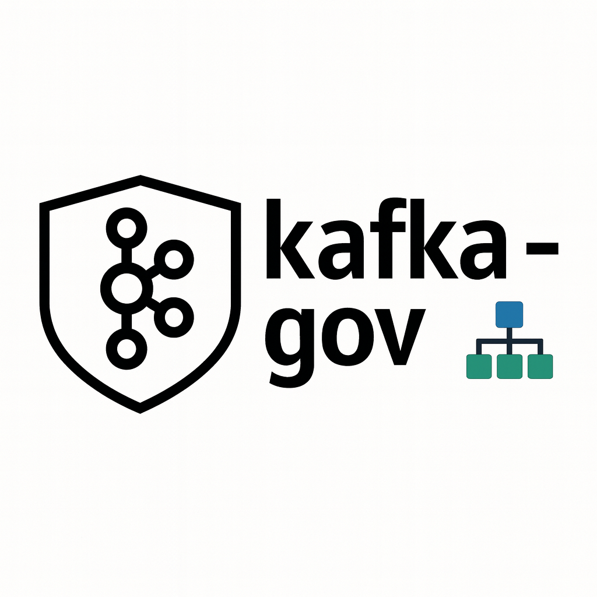

<div align="center">
  

  # 🛡️ Data Gov

  **Schema Registry–backed schema governance workflows with policy controls, approvals, and audit history**
</div>

---

## What this repository is now

This repository is intentionally narrowed to one dependable vertical slice:

- **Schema Registry connections**
- **Schema lifecycle management**
- **Schema governance**
  - compatibility
  - policy checks
  - change planning / rollback planning
  - approval-aware apply flow
  - audit/history

It is **not** currently a Kafka operations console, topic management tool, or a full data-governance platform.

---

## Current boundary

### Kept
- Schema Registry CRUD / activate / test
- schema upload / sync / search / detail
- schema version history
- schema policies
- batch dry-run / apply
- rollback planning
- delete analysis / guarded delete
- approval + audit support for schema changes

### Removed from active runtime
- Kafka broker management
- topic management / topic hints
- consumer / websocket surfaces
- dormant future-state domains (`product`, `contract`, `catalog`, `lineage`, `governance`)

---

## Quick start

### Backend
```bash
uv sync --group dev
bash script/migrate.sh
uv run uvicorn app.main:app --reload
```

### Frontend
```bash
npm install --prefix frontend
npm run dev --prefix frontend
```

Open:
- Frontend: `http://localhost:3000`
- Backend docs: `http://localhost:8000/swagger`

---

## Main routes

### Frontend
- `/schemas`
- `/schemas/:subject`
- `/schemas/policies`
- `/connections`

### API
- `/api/v1/schema-registries/*`
- `/api/v1/schemas/*`

---

## Documentation
- [Docs Index](./docs/index.md)
- [Architecture Overview](./docs/architecture/overview.md)
- [Current System Analysis](./docs/architecture/current-system-analysis.md)
