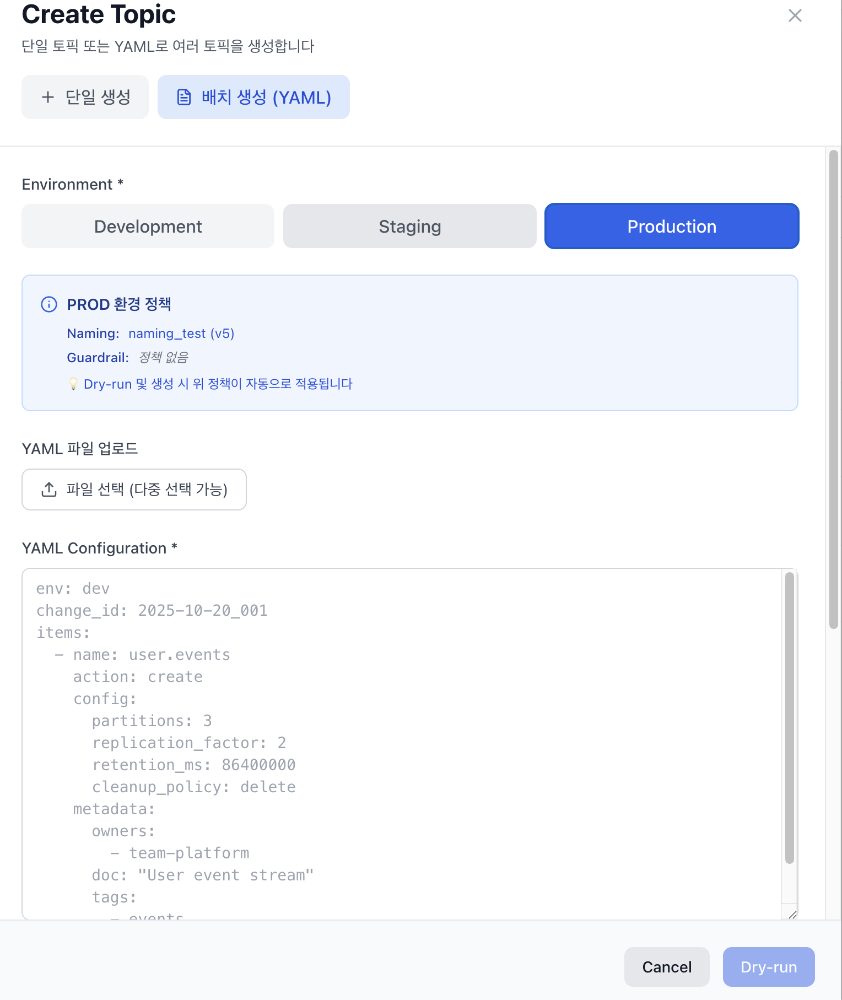

# 📊 Topic Management

Complete guide to managing Kafka topics with rich metadata and governance.

## Overview

Kafka-Gov transforms Kafka topics from simple message queues into well-documented, governed resources with:
- **Ownership tracking** (team, owner)
- **Documentation links** (Wiki, Confluence)
- **Custom tags** (pii, critical, deprecated)
- **Environment labels** (DEV, STG, PROD)

---

## Topic Dashboard

<div align="center">
  
</div>

### Key Features

- **Filter by Owner/Team**: Find topics owned by specific teams
- **Tag-based Search**: Filter by `pii`, `critical`, `deprecated` tags
- **Documentation Links**: Quick access to Wiki/Confluence pages
- **Environment Management**: Separate views for DEV/STG/PROD
- **Instant Metrics**: Partitions, replication, retention at a glance
- **Real-time Search**: Multi-filter search with instant results

---

## Rich Topic Metadata

Every topic in Kafka-Gov includes:

| Field | Required | Description | Example |
|-------|----------|-------------|---------|
| **Owner** | ✅ | Team or individual responsible | `team-commerce` |
| **Documentation** | ✅ | Link to Wiki/Confluence | `https://wiki.company.com/orders` |
| **Tags** | ❌ | Classification labels | `["orders", "critical", "pii"]` |
| **Environment** | ✅ | Deployment environment | `prod` |
| **Partitions** | ✅ | Number of partitions | `12` |
| **Replication Factor** | ✅ | Number of replicas | `3` |
| **Min ISR** | ✅ | Minimum in-sync replicas | `2` |
| **Retention** | ❌ | Message retention period | `604800000` (7 days) |

---

## Creating Topics

### Single Topic Creation

<div align="center">
  
</div>

**Steps:**
1. Click "Single Topic Creation" in Topics tab
2. Fill in the form:
   - Environment (DEV/STG/PROD)
   - Topic name (e.g., `prod.order.count`)
   - Partitions, Replication Factor, Min In-Sync Replicas
   - Owner (team name)
   - Documentation URL (required)
   - Tags (optional)
3. Click "Create"

**API Example:**
```bash
curl -X POST "http://localhost:8000/api/v1/topics" \
  -H "Content-Type: application/json" \
  -d '{
    "name": "prod.orders.created",
    "partitions": 12,
    "replication_factor": 3,
    "config": {
      "retention.ms": "604800000",
      "min.insync.replicas": "2"
    },
    "metadata": {
      "owner": "team-commerce",
      "doc": "https://wiki.company.com/orders",
      "tags": ["orders", "critical"],
      "env": "prod"
    }
  }'
```

---

## Batch Operations

See [Batch Operations Guide](./batch-operations.md) for YAML-based bulk topic management.

---

## Updating Topics

### Update Partitions

**⚠️ Warning**: Increasing partitions is irreversible!

```bash
curl -X PATCH "http://localhost:8000/api/v1/topics/prod.orders.created" \
  -H "Content-Type: application/json" \
  -d '{
    "partitions": 24
  }'
```

### Update Configuration

```bash
curl -X PATCH "http://localhost:8000/api/v1/topics/prod.orders.created" \
  -H "Content-Type: application/json" \
  -d '{
    "config": {
      "retention.ms": "1209600000"
    }
  }'
```

### Update Metadata

```bash
curl -X PATCH "http://localhost:8000/api/v1/topics/prod.orders.created/metadata" \
  -H "Content-Type: application/json" \
  -d '{
    "owner": "team-platform",
    "tags": ["orders", "critical", "migrated"]
  }'
```

---

## Deleting Topics

**⚠️ Warning**: Topic deletion is permanent and cannot be undone!

### Via UI
1. Navigate to Topics page
2. Find topic to delete
3. Click "Delete" button
4. Confirm deletion

### Via API
```bash
curl -X DELETE "http://localhost:8000/api/v1/topics/dev.test.temporary"
```

---

## Naming Conventions

Kafka-Gov supports **3 built-in naming strategies + custom rules**.

See [Naming Policy Guide](./naming-policy.md) for detailed information.

---

## Topic Detail View

<div align="center">
  
</div>

**Available Information:**
- **Configuration**: All Kafka topic configs
- **Partition Details**: Leader, replicas, ISR for each partition
- **Consumer Groups**: All groups consuming this topic
- **Health Metrics**: Lag, rebalance stability, fairness index
- **Governance Alerts**: Policy violations, stuck partitions
- **Audit History**: All changes made to this topic

---

## Best Practices

### Naming
- Use environment prefix: `prod.`, `stg.`, `dev.`
- Include domain: `prod.orders.`, `prod.users.`
- Be descriptive: `prod.orders.created` not `prod.oc`

### Partitions
- Start with `(peak_throughput_msgs_per_sec / target_consumer_throughput) × 2`
- Consider consumer parallelism needs
- Account for future growth (partitions cannot be decreased)

### Replication
- **DEV**: 1-2 replicas (data loss acceptable)
- **STG**: 2 replicas (balance cost and reliability)
- **PROD**: 3+ replicas (high availability required)

### Min ISR
- Set to `replication_factor - 1` for production
- Prevents data loss during broker failures
- Trade-off: Availability vs durability

### Retention
- Default: 7 days (`604800000` ms)
- Logs: 1-3 days
- Events: 7-30 days
- CDC: Infinite (`-1`)

### Tags
- Use consistent taxonomy: `pii`, `critical`, `deprecated`, `temporary`
- Tag high-value topics for monitoring
- Tag PII data for compliance audits

---

## Troubleshooting

### Topic creation fails with policy violation
**Cause**: Topic name or config violates environment policy

**Solution**: Check policy requirements:
```bash
curl http://localhost:8000/api/v1/policies/{env}
```

### Cannot increase partitions
**Cause**: Kafka does not allow partition decrease

**Solution**: 
1. Create new topic with desired partitions
2. Migrate consumers
3. Delete old topic

### Replication factor too low warning
**Cause**: Production topic with RF < 3

**Solution**: Increase replication factor (requires topic recreation)

---

## Related Documentation

- [Batch Operations](./batch-operations.md)
- [Naming Policy](./naming-policy.md)
- [Policy Enforcement](./policy-enforcement.md)
- [Audit Trail](../operations/audit-trail.md)
- [API Reference](../api/topics.md)
